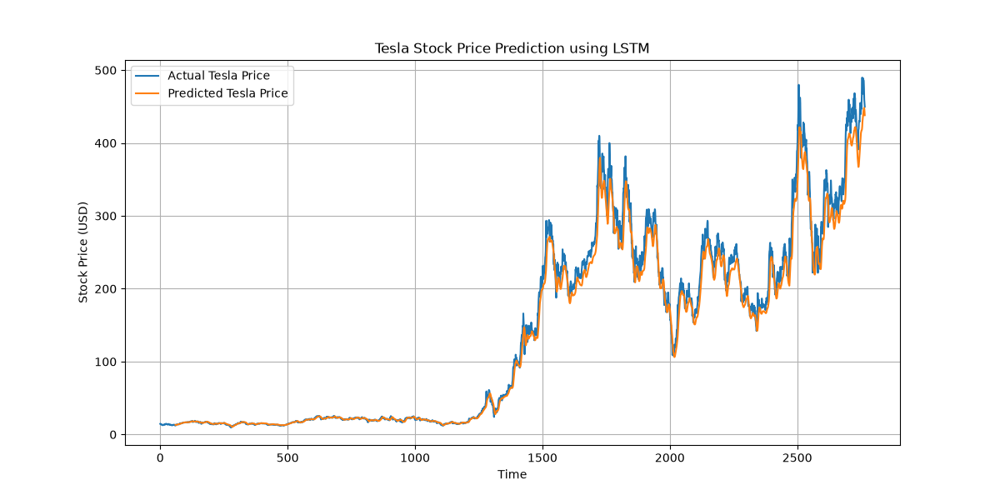

# Tesla Stock Price Prediction using LSTM

## 📌 Project Overview

This project predicts Tesla (TSLA) stock prices using a Long Short-Term Memory (LSTM) neural network.

Historical Tesla stock data is collected using Yahoo Finance, preprocessed using Python, and used to train an LSTM model for stock price prediction.

## 🎯 Objective

The main objective of this project is to analyze historical Tesla stock prices and use an LSTM deep learning model to predict future stock price trends.

## 🛠️ Technologies Used

- Python
- TensorFlow
- Keras
- NumPy
- Pandas
- Matplotlib
- Scikit-learn
- yFinance
- LSTM

## 🔄 Project Workflow

1. Fetch Tesla stock data using yFinance.
2. Preprocess and normalize the historical data.
3. Create training and testing datasets.
4. Build an LSTM neural network.
5. Train the model using historical stock prices.
6. Generate predictions on test data.
7. Compare actual and predicted prices.
8. Save the trained model.

## 📊 Results

The project generates a comparison graph between the actual Tesla stock prices and the prices predicted by the LSTM model.

### Prediction Graph



## 📁 Project Structure

```text
tesla-stock-prediction/
│
├── train_model.py
├── requirements.txt
├── tesla_lstm_model.keras
├── tesla_prediction.png
├── README.md
└── .gitignore